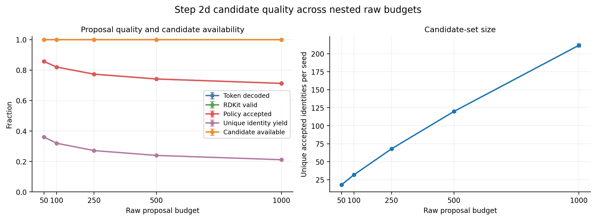
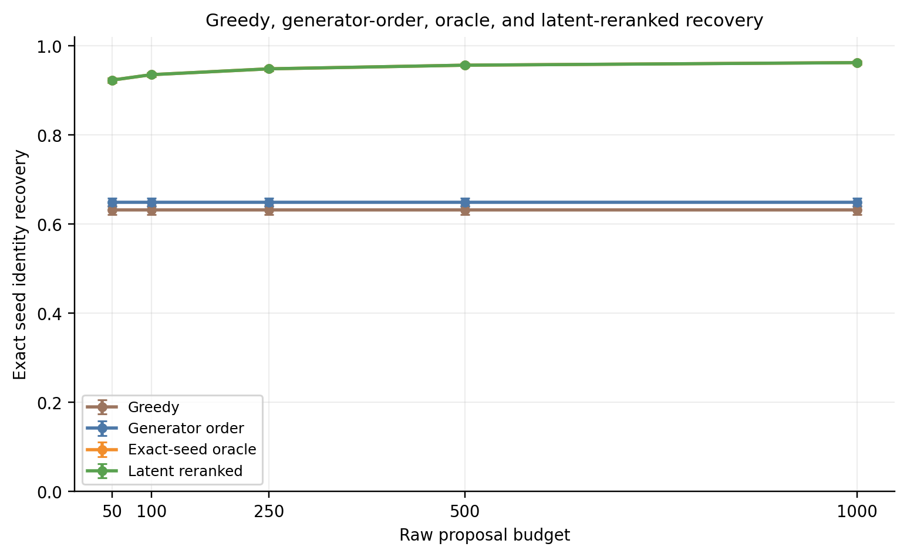
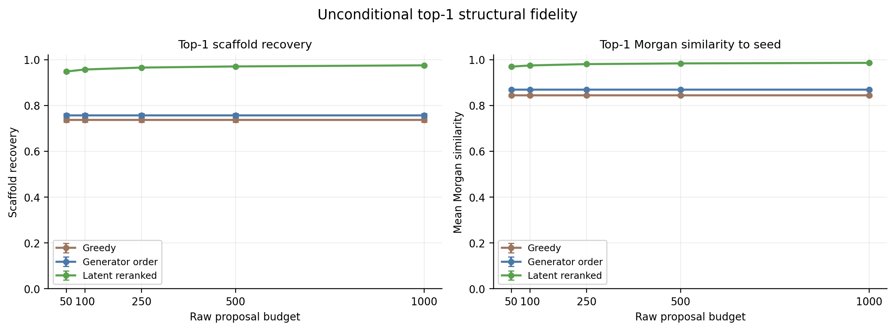
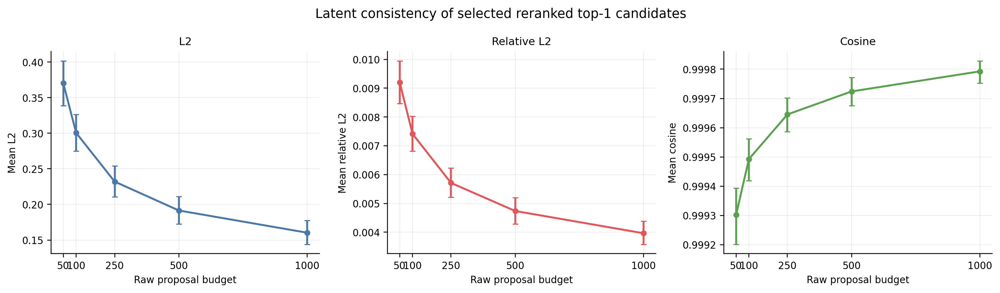
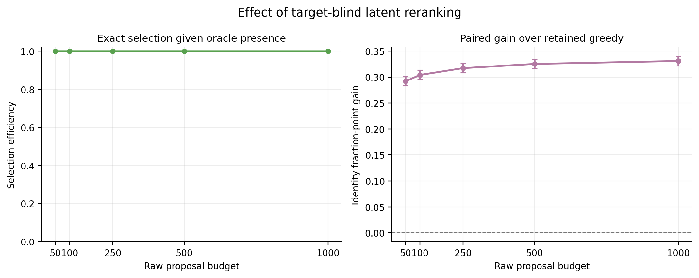

# Step 2b-style search and latent-reranking analysis of Step 2d

This report evaluates the frozen 10,000-seed Step 2d final candidate library at literal raw proposal prefixes. It adds no generation, training, latent perturbation, property analysis, controls, or decision gate.

All globally unique accepted molecules were re-encoded once in released_hybrid_w3 space with batch size 512 and 48 workers. Reranking is target-blind: lower relative L2, then higher cosine, lower raw rank, and lexical canonical SMILES. Intervals are paired 2,000-resample seed-bootstrap 95% percentile intervals.

## Main estimates

| Raw budget | RDKit valid | Policy accepted | Mean unique | Candidate available | Greedy exact@1 | Generator exact@1 | Oracle recall | Reranked exact@1 | Selection efficiency | Gain over greedy | Reranked scaffold | Reranked Morgan | Reranked rel-L2 | Reranked cosine |
|---:|---:|---:|---:|---:|---:|---:|---:|---:|---:|---:|---:|---:|---:|---:|
| 50 | 85.68% | 85.68% | 18.0 | 100.00% | 63.14% | 64.93% | 92.33% | 92.33% | 100.00% | +29.19% | 94.80% | 0.9692 | 0.0092 | 0.9993 |
| 100 | 82.00% | 81.99% | 32.0 | 100.00% | 63.14% | 64.93% | 93.55% | 93.55% | 100.00% | +30.41% | 95.69% | 0.9746 | 0.0074 | 0.9995 |
| 250 | 77.33% | 77.32% | 67.9 | 100.00% | 63.14% | 64.93% | 94.86% | 94.86% | 100.00% | +31.72% | 96.52% | 0.9803 | 0.0057 | 0.9996 |
| 500 | 74.15% | 74.14% | 119.8 | 100.00% | 63.14% | 64.93% | 95.68% | 95.68% | 100.00% | +32.54% | 97.02% | 0.9834 | 0.0047 | 0.9997 |
| 1,000 | 71.30% | 71.27% | 211.6 | 100.00% | 63.14% | 64.93% | 96.26% | 96.25% | 99.99% | +33.11% | 97.50% | 0.9858 | 0.0040 | 0.9998 |

The complete estimates and confidence limits are in outputs/tables/bootstrap_cis.csv; the per-seed numerator data are retained in outputs/tables/per_seed_budget_metrics.parquet.

## Figures

Every figure is also exported as SVG, and each has an exact CSV source table under outputs/plot-data.
